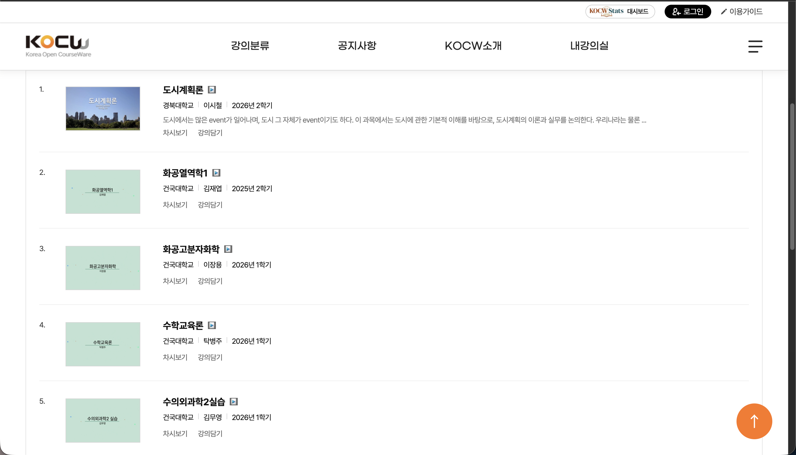
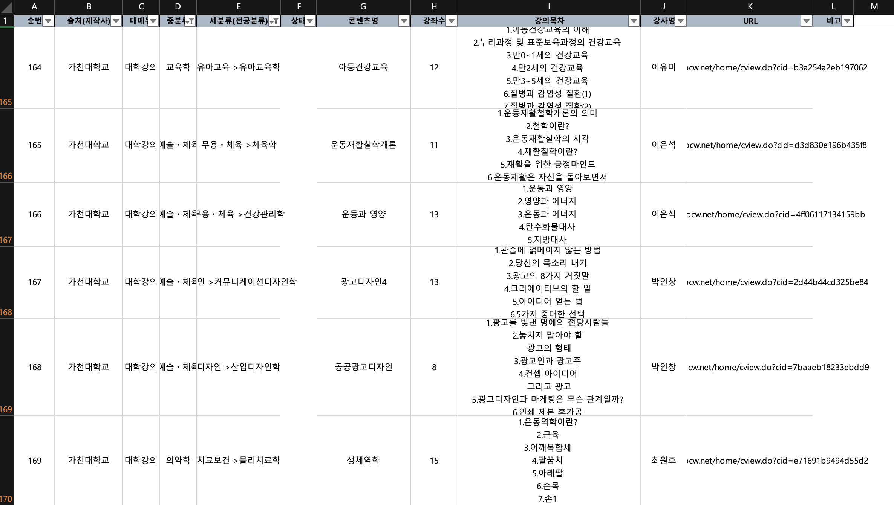

# web-crawler

강의 공개 사이트 데이터를 엑셀 양식에 맞춰 모아 주는 작은 토이 프로젝트입니다.

<p align="center">
  
</p>

<p align="center">
  <b>⬇️</b>
</p>

<p align="center">
  
</p>

## 제작 배경

여자친구가 강의 정보를 엑셀에 열심히 수작업으로 일일이 복붙하고 있길래, 소프트웨어 학도로서 참을 수 없어서 만들었습니다.  
수작업으로 하던 분류·강의명·목차·URL 정리를 크롤러가 대신하고, 기존 엑셀 시트 양식 그대로 결과 파일을 돌려줍니다.

## 분류 방식

| 대상 | 스크립트 | 결과 시트 |
|------|----------|-----------|
| [KOCW](https://www.kocw.net/home/index.do) 대학강의·기관강의 | `crawl_kocw.py` | `KOCW` |

원본 템플릿 엑셀에는 `KOCW`, `K-MOOC`, `주경야독`, `해커스`, `박문각` 등 여러 시트가 있고,  
KOCW 크롤러는 **`KOCW` 시트만** 갱신한 뒤 나머지 시트는 그대로 둡니다.

### KOCW 시트 컬럼

순번 · 출처(제작사) · 대메뉴 · 중분류 · 세분류(전공분류) · 상태 · 콘텐츠명 · 강좌수 · 강의목차 · 강사명 · URL · 비고

## 설치

```bash
cd /Users/jhlee/workspace/web-crawler
python3 -m venv .venv
source .venv/bin/activate
pip install -r requirements.txt
```

템플릿 엑셀(`제발정신차려 이걸 날리면 어떡하니.xlsx`)이 프로젝트 루트에 있어야 합니다.

## 사용법 (KOCW)

```bash
source .venv/bin/activate

# 전체 (대학 + 기관)
python crawl_kocw.py --workers 2 --delay 0.5

# 대학만 / 기관만
python crawl_kocw.py --menu univ
python crawl_kocw.py --menu org

# 테스트 (N건만)
python crawl_kocw.py --limit 3
```

결과는 `KOCW_크롤링결과_날짜시간.xlsx`로 저장됩니다.

### 캐시

재실행 시 이미 받은 데이터는 건너뜁니다.

| 파일 | 역할 |
|------|------|
| `.cache/kocw_stubs.json` | 강의 목록 (URL·제목 등) |
| `.cache/kocw_details.json` | 상세 페이지 (분류·목차 등) |

목록을 처음부터 다시 받으려면:

```bash
python crawl_kocw.py --refresh-listing --workers 2 --delay 0.5
```

상세 수집에 실패한 행은 엑셀 `비고`에 `상세수집실패`로 남고, 다음 실행 때 그 건만 다시 시도합니다.

## 의존성

- Python 3
- `requests`, `beautifulsoup4`, `lxml`, `openpyxl`
